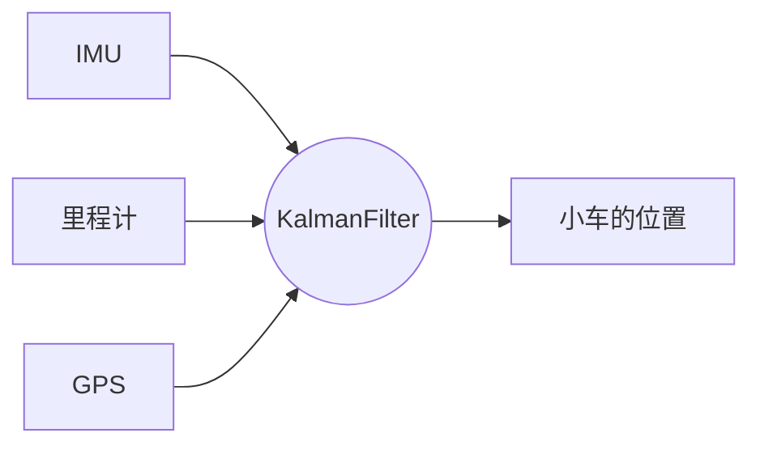

###                               卡尔曼滤波-Simulink仿真 

​			                                                              自动化1901	20197097	吴坷

描述:卡尔曼滤波是一种优化估计算法(an optimal estimation algorithm)

​		  卡尔曼滤波器也称传感器融合算法

卡尔曼滤波器最早应用在阿波罗登月工程中，用来估算载人航天往返月球的轨迹

[toc]

- (1 2 3 4为理论介绍、5 6 为Simulink仿真)

$————————————————————————————————————————————————————$

### 1. Kalman filter 常见的两中用途

#### 1.1 估算不可直接观测的变量

如果你想检测火箭燃烧室的温度，无法直接在燃烧室放传感器，只能将传感器放在燃烧室外部

这时 Kalman filter可以作为状态观测器，输入是燃烧室外某个位置的温度，输出是燃烧室内部的温度。

#### 1.2 观测系统的状态

$$
假如你开着一辆车，车上有三种传感器: \quad \quad \quad \quad  \quad \quad \quad \quad \quad \quad \quad \quad \quad \quad \quad \quad \quad \quad \quad \quad \quad \\
\left\{\begin{matrix}
\quad \quad \quad \quad \quad IMU(加速度传感器和角加速度传感器)\\里程计
 \\GPS

\end{matrix}\right.
$$

- IMU和里程计可以接受车的位置变化信息，可以快速更新，但是也很容易飘移。
- GPS接受车的绝对位置，更新没那么快，但容易有噪音。

我们可以构造卡尔曼滤波器，输入时三个传感器的度数，输出是小车的估算位置。

- 卡尔曼滤波器是一种设计最有状态观测器的方法

  

### 2.状态观测器

状态观测器用来帮助你估计无法直接查看或测量的内容。

**在数学中，常用$\hat{x} $来表示估计状态。**

目标: $\hat{x}逼近于x$

假设一个线性化系统解释一波:

### 3. Kalman滤波解释

$$
e_{obs} = x - \hat{x} \\
\dot{x}=Ax+Bu①\\
\dot{\hat{x}}=A\hat{x}+Bu+K(y-\hat{y}) ②\quad y = Cx,\hat{y}=C\hat{x} \\
①-②=\dot{e_{obs}}=(A-KC)e_{obs} \Rightarrow e_{obs}(t)=e^{(A-KC)t}e_{obs}(0) \\
我们希望(A-KC)< 0
$$

- $$
  u_k:过程噪声，可能是风速，轮胎抖动造成的 \\
  v_k:测量噪声 \qquad \qquad \qquad \quad \quad \quad \quad \quad \quad
  $$

- 通常情况下，这些噪声是服从某一个特定分布的,比如:

  - $v(测量误差)$~$N(0,R)$

- 测量值并不能反映真实状态且我们也不发简历完全准确的数学模型来反映y与u的关系

  

 已知: $\quad$ $(u_{k},y_{k-1})和car-model$ 

根据已知推理得到的$\hat{x_{k-1}}$本身就有误差(噪声)，再根据$\hat{x_{k-1}}$ 以及已知推理得到的$\hat{x_{k}}$的误差更大

之后经过一个时间单位，我们测得$y_k$，然后根据$y_k和\hat{x_k} \Rightarrow x_{k}$

$$
{\color{Red}卡尔曼滤波器就是一种为随机系统设计的状态观测器 \qquad \qquad \qquad \qquad \qquad \qquad \qquad \qquad \qquad} \\
{\color{Red} \hat{x_k}=A\hat{x_{k-1}}+Bu_k+K(y_k-C(A\hat{x_{k-1}}+Bu_k))}
$$

- （Prediction）$A\hat{x_{k-1}}+Bu_k$ 表示根据前一个时间步和数学模型估算的当前状态。记作$\hat{x_k^-}$,我们称为预测估值
- （Update）式就可以写成${\color{Red} \hat{x_k}=\hat{x_k^-}+K(y_k-C\hat{x_k^-)}} $，我们称为后验估值

因此我们发现，卡尔曼滤波器分两步:

####  3.1 预测估值

 

$P_k^-$用来描述噪声导致的不确定性的影响，Q代表过程噪声的协方差

#### 3.2 后验估值

R代表测量噪声的协方差

调整K使得$P_k$​最小， 即通过调整K，对于数学模型预测出来的值和状态观测反推出来的值权重加和

- 即如果噪声小，那么后验估值更可信，如果噪声大，预测估值更可信

- 我们可以假设这样两个极端情况;

  - $ P_k=0  = 0(测量噪声协方差为0) \Rightarrow K = \frac{1}{C}\Rightarrow \hat{x_k}=\frac{1}{C}y_k$

  ​      因此我们得到当前状态估计值=测量结果反推值
  - 
$P_{k}^-=0(过程噪声协方差为0) \Rightarrow K=\frac{AP_{k-1}A^TC^T}{----}=0 \Rightarrow \hat{x_k}=\hat{x_k^-}$

### 4. 非线性状态估算器(EKF、UKF、PF)简介

$$
系统的状态方程变为: \qquad \qquad \qquad \qquad \qquad \qquad \qquad \qquad\qquad \qquad \qquad \qquad \qquad  \qquad \qquad \qquad \qquad \qquad \\
x_k = f(x_{k-1},u_k)+w_k \\
y_k = g(x_{k})+v_k
$$

因为卡尔曼滤波器只针对线性系统，此处必须使用非线性状态估算器来代替卡尔曼滤波器。

我们称之为Extended Kalman Filter(扩展卡尔曼滤波器)

- **EKF**	正态分布经过线性变换之后仍然是正态分布，但是EKF把非线性函数在当前估算状态下线性化

但是EKF有很多缺点，一次线性化并不能完美的表示抖动比较剧烈的系统

- **UKF** 	还有一种滤波器叫无味卡尔曼滤波器(Unscented Kalman Filter)

在原始概率分布均匀选择采样点，然后映射到非线性变换之后，按照采样点映射后的值重新构造一个最近似的高斯分布

- 粒子滤波器(Particle Filter)

就是把UKF中的采样点换成大量的随机分布的采样点，然后直接得到变换的概率模型

### 5. KF估计单摆模型角度(Simulink)

我们可以用旋转电位计测得单摆线与垂直方向的夹角$\theta$, 但是我们的测量结果有很多噪声

 **step 1 建立数学模型**
$$
l\frac{d^2\theta}{dt^2}+mglsin(\theta)=\tau	\quad (\tau代表手给的力) \\
线性化: \\
 l\frac{d^2\theta}{dt^2}+mgl\theta=\tau \\
 我们选择x_1=\theta,x_2=\dot{\theta},u=\tau ,y=\theta	\\
 \begin{bmatrix}
\dot{x_1} \\ \dot{x_2}

\end{bmatrix}
= 
\begin{bmatrix}
 0 & 1\\
 0 & -\frac{g}{l}
\end{bmatrix}

\begin{bmatrix}
x_1 \\ x_2

\end{bmatrix}
 + \begin{bmatrix}
 0\\ \frac{u}{ml^2}

\end{bmatrix}
\\
y=\begin{bmatrix}
 1 &0
\end{bmatrix}x
$$
**step 2 simulink仿真**

- 下载simscape_multibody创建的单摆模行

  - https://ww2.mathworks.cn/matlabcentral/fileexchange/105525-kalman-filter-virtual-lab

- 打开文件夹内的 projrct.prj --> 打开virtualPendulumModel.slx(允许高版本模型)

  

| English          | Chinese |
| -------------- | ---------- |
| Pivot          | 天花板顶座 |
| Revolute Joint | 转轴       |
| Link |连杆    |

KF通过最小化误差协方$P_k$来求解卡尔曼增益$K$,最终求解出$\hat{x}$

#### 5.1 KF-Simulink

- 选择$\theta_0 =\frac{\pi}{18}$

  KF适用于线性系统，但是单摆模行不是一个线性系统，选择小范围，非线性失真小一些

  KF的观测效果良好

  

- 选择$\theta_0 =\frac{\pi}{3}$

  但是**开摆**范围较大的时候，KF的效果很差，这时需要引入非线性模型EKF

  

#### 5.2 EKF-Simulink
扩展卡尔曼滤波器估算的离散非线性系统的状态。

- 初始角度还是选择$\theta_0 =\frac{\pi}{3}$

显然，相比于KF，EKF这种非线性模型对于非线性系统有很好的效果。
