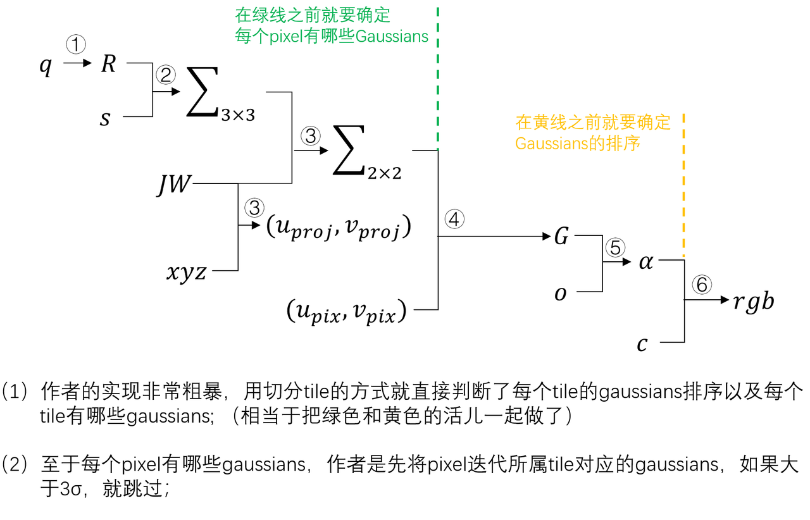

# 对于3DGS Forward&Backward 的粗浅总结
> 笔者初学小白，有错误的地方欢迎指正！(本文只涉及CUDA代码部分的内容，和训练,densify啥的无关)
# Basic Math Knowledge
只看前向传播的话，知道协方差矩阵和特征值是啥就可，看反向传播的话需要知道矩阵求梯度的计算法则，建议读一下参考文献的[1]（不读也行）；
  
只看前向传播的话，知道协方差矩阵和特征值是啥就可，看反向传播的话需要知道矩阵求梯度的计算法则，建议读一下参考文献的[1]；
- (1) 协方差矩阵是啥[4]：
   椭球方程（半轴长分别是$a,b,c$）:
  $$\frac{(x-\bar{x})}{a^2}+\frac{(y-\bar{y})^2}{b^2}+\frac{(z-\bar{z})^2}{z^2} = 1$$
  但是这椭球的三个轴都是平行于坐标轴的，假设对这个椭球的每个点$(x,y,z-\bar{x},\bar{y},\bar{z})$以$(\bar{x},\bar{y},\bar{z})$为中心都做一步旋转$R$，就可以得到一个任意姿态的三维空间的椭球方程$(x_{new}, y_{new}, z_{new})$：
  $$V(xyz)= [x-\bar{x}, y-\bar{y}, z-\bar{z}]^T$$
  $$V(xyz) = R^{-1}V(xyz_{new}) $$
  椭球公式变成：
  $$\frac{(R^{-1}[0,:] \cdot V(xyz_{new}) )^2}{a^2} + \frac{(R^{-1}[1,:] \cdot V(xyz_{new}) )^2}{b^2} + \frac{(R^{-1}[2,:] \cdot V(xyz_{new}) )^2}{c^2} = 1 \\$$

  $$(\frac{R^{-1}[0,0]^2}{a^2} + \frac{R^{-1}[1,0]^2}{b^2} + \frac{R^{-1}[2,0]^2}{c^2}) (x_{new} - \bar{x})^2 + \\(\frac{R^{-1}[0,1]^2}{a^2} + \frac{R^{-1}[1,1]^2}{b^2} + \frac{R^{-1}[2,1]^2}{c^2}) (y_{new} - \bar{y})^2 + \\(\frac{R^{-1}[0,2]^2}{a^2} + \frac{R^{-1}[1,2]^2}{b^2} + \frac{R^{-1}[2,2]^2}{c^2}) (z_{new} - \bar{z})^2 + \\(...) (x_{new} - \bar{x})(y_{new} - \bar{y}) + \\ (...) (y_{new} - \bar{y})(z_{new} - \bar{z}) + \\(...)(x_{new} - \bar{x})(z_{new} - \bar{z}) = 1$$

  $$  \Rightarrow$$
  $$\begin{bmatrix}
  x_{new}-\bar{x} &  y_{new}-\bar{y} &  z_{new}-\bar{z}
  \end{bmatrix} R^{-1} \begin{bmatrix}
  \frac{1}{a^2} &  & \\
    &  \frac{1}{b^2} & \\
    &  &  \frac{1}{c^2}
  \end{bmatrix} (R^{-1})^T \begin{bmatrix}
    x_{new}-\bar{x} \\ y_{new}-\bar{y}
  \\ z_{new}-\bar{z}
  \end{bmatrix} = 1$$
  这个新的矩阵就是$(\Sigma_{3\times 3})^{-1}$, 特征值的定义是: $|X - \lambda I| = 0 $
  $$ 
  | R^{-1} \begin{bmatrix}
  \frac{1}{a^2} &  & \\
    &  \frac{1}{b^2} & \\
    &  &  \frac{1}{c^2}
  \end{bmatrix} (R^{-1})^T - \lambda I | = 0 \\
  |\begin{bmatrix}
  \frac{1}{a^2} &  & \\
    &  \frac{1}{b^2} & \\
    &  &  \frac{1}{c^2}
  \end{bmatrix}R - \lambda R| = 0 \\
  \Rightarrow \lambda = \begin{bmatrix}
  \frac{1}{a^2} &  & \\
    &  \frac{1}{b^2} & \\
    &  &  \frac{1}{c^2}
  \end{bmatrix}$$
  二阶椭圆方程也同理，因此在求出2D投影的协方差矩阵之后要求逆然后特征值是两个半轴的长度；


   
- (2) $\nabla$和 $\Delta$分别是啥：
假设系统的最终输出是$S_o$, $S_o = f(C) , C = g(A, B) $
俺们可以得出：
$$\nabla C := \frac{d S_o}{dC} \\
\nabla A :=   \nabla C \frac{\partial C}{\partial A}$$
很好，我学了老半天也没学会矩阵求导🐷，问题不大，下面的推导都是逐元素的，只要会高中数学的求导就可以理解。
# Vanilla 3DGS, SIGGRAPH2023
> https://github.com/graphdeco-inria/gaussian-splatting
## 概述
（主函数在`diff-gaussian-rasterization/cuda_rasterizer/rasterizer_impl.cu/"int CudaRasterizer::Rasterizer::forward(...)"`）
- STEP 1: 分配$(p+255/256)$个block, 每个block有256个thread, 对每个高斯做`preprocessCUDA(...)`;
- STEP 2: 生成buffer并对高斯做排序；
- STEP 3: 分配$num\_tiles$个block,每个block有256个thread，对每个pixel做渲染;

### STEP 1 
- `diff-gaussian-rasterization/cuda_rasterizer/forward.cu/"FORWARD::preprocess"/"preprocessCUDA"`:
  - 计算$\Sigma_{2 \times 2}$
  - 计算gaussians的投影半径`radii`, 计算gaussians属于哪个tile`tiles_touched`
  - 如果用的sh，将sh转成rgb；
  - 记录gaussians的像素坐标`points_xy_image`;
  - 将$[\Sigma_{2\times  2},opacity]$存成`conic_opacity`；
  - 记录gaussians接触到的tiles的数目`tiles_touched`，注意这里是数目不是序号;
### STEP 2
- `duplicateWithKeys`和`cub::DeviceRadixSort::SortPairs`:
  - 创建buffer并记录每个gaussian`gaussian_values_unsorted` touch到了哪些tile_ids`gaussian_keys_unsorted`；
  ```cpp
  // diff-gaussian-rasterization/cuda_rasterizer/rasterizer_impl.cu
  __global__ void duplicateWithKeys
  // gaussian_keys_unsorted.shape[0] = sum(each_gaussian_touch_tiles_num)
  // gaussian_keys_unsorted的每一项记录的是tile的索引;
  // gaussian_values_unsorted的每一项记录的是gaussian的索引;
  ```
  - `cub::DeviceRadixSort::SortPairs`是CUB库的一个内置函数，经过排序后得到①`point_list`: 排序之后的 tile*gaussians 对应的gaussians_id; ② `point_list_keys`: 排序之后的 tile*gaussians 对应的 tile_id;
  - `identifyTileRanges`: 这里直接按照tile_id切开就行，然后得到的`imgState.ranges`是dim2, shape=(N_tile, 2)，用这个可以直接索引每个tile下的gaussians_id们;
### STEP 3
渲染人们比较熟悉，分成<numtiles_u*numtiles_v, 16*16>渲染，每个thread是这样的：
- `diff-gaussian-rasterization/cuda_rasterizer/forward.cu/"renderCUDA(...)"`: 这个函数的最外层的for循环是针对tile滴；
  - 拿到当前pixel下的从前到后排好序的gaussians_ids：
uint2 range = ranges[block.group_index().y * horizontal_blocks + block.group_index().x];
  - 下面是两层循环，第一层循环的循环次数是`toDo`代表当前block(tile)下高斯数量；内层循环的循环次数是`BLOCK_SIZE(256)`，代表对当前tile的pixel数；
  - 迭代每个高斯之后要`block.sync()`即所有当前block下的所有thread等同步；
  - 对于内层循环干的活儿很简单：
    - 计算$G$:
    ```cpp
    float power = -0.5f * (con_o.x * d.x * d.x + con_o.z * d.y * d.y) - con_o.y * d.x * d.y;
    ```
    - 计算$\alpha$并按3通道循环累加颜色（如果$\alpha<1/255$或者后面的累计不透明度`T<1e-4` 都直接跳过，不再做累加颜色运算）
  - 结尾还有一个循环次数为256的小循环，就是把上面计算的结果赋值给pixel；
梯度传播图
这里的球谐是根据sh直接线性计算出来的，我这里的$c$就是计算好的`colors_precomp`。



## Forward👉
### ① ② $(q,s) \Rightarrow \Sigma_{3\times 3}$
- 数学公式很简单：
$$q = \begin{bmatrix}
  w & x & y & z
\end{bmatrix}^T / \sqrt{w^2+x^2+y^2+z^2} \\
R = \begin{bmatrix} 1 - 2q_2^2 - 2q_3^2 & 2q_1q_2 - 2q_0q_3 & 2q_1q_3 + 2q_0q_2 \\ 2q_1q_2 + 2q_0q_3 & 1 - 2q_1^2 - 2q_3^2 & 2q_2q_3 - 2q_0q_1 \\ 2q_1q_3 - 2q_0q_2 & 2q_2q_3 + 2q_0q_1 & 1 - 2q_1^2 - 2q_2^2 \end{bmatrix}\\
\Sigma_{3\times 3} = RS (RS)^T$$
- 代码里是这样的:
  ```cpp
  # scene/gaussian_model.py
  self.rotation_activation = torch.nn.functional.normalize

  @property
  def get_rotation(self):
      return self.rotation_activation(self._rotation)

  # gaussian_render/__init__.py
  rotations = pc.get_rotation
  // diff-gaussian-rasterization/cuda_rasterizer/forward.cu
  // __global__ void preprocessCUDA(...)
  computeCov3D(scales[idx], scale_modifier, rotations[idx], cov3Ds + idx * 6);
  cov3D = cov3Ds + idx * 6;

  // diff-gaussian-rasterization/cuda_rasterizer/forward.cu
  // __device__ void computeCov3D(...)
  // Create scaling matrix
  glm::mat3 S = glm::mat3(1.0f);
  S[0][0] = mod * scale.x;
  S[1][1] = mod * scale.y;
  S[2][2] = mod * scale.z;
  // Compute rotation matrix from quaternion
  glm::mat3 R = glm::mat3(
      1.f - 2.f * (y * y + z * z), 2.f * (x * y - r * z), 2.f * (x * z + r * y),
      2.f * (x * y + r * z), 1.f - 2.f * (x * x + z * z), 2.f * (y * z - r * x),
      2.f * (x * z - r * y), 2.f * (y * z + r * x), 1.f - 2.f * (x * x + y * y)
  );
  glm::mat3 M = S * R;
  // Compute 3D world covariance matrix Sigma
  glm::mat3 Sigma = glm::transpose(M) * M;
  // Covariance is symmetric, only store upper right
  cov3D[0] = Sigma[0][0];
  cov3D[1] = Sigma[0][1];
  cov3D[2] = Sigma[0][2];
  cov3D[3] = Sigma[1][1];
  cov3D[4] = Sigma[1][2];
  cov3D[5] = Sigma[2][2];
  ```

### ③ $(JW, \Sigma_{3\times 3}) \Rightarrow \Sigma_{2\times 2}$
- 数学公式很简单：
$$\Sigma_{2\times2} = JW \Sigma_{3\times 3} (JW)^T \\
\begin{bmatrix} u \\\ v \end{bmatrix} = \begin{bmatrix} f_x & 0 & c_x \\\ 0 & f_y & c_y \end{bmatrix} \begin{bmatrix} \frac{x}{z} \\\ \frac{y}{z} \\\ 1 \end{bmatrix}$$
- 代码里是这样的：
    ```cpp
    // diff-gaussian-rasterization/cuda_rasterizer/forward.cu
    // __global__ void preprocessCUDA(...)
    float3 p_orig = { orig_points[3 * idx], orig_points[3 * idx + 1], orig_points[3 * idx + 2] };
    float3 cov = computeCov2D(p_orig, focal_x, focal_y, tan_fovx, tan_fovy, cov3D, viewmatrix);

    // ↓

    // diff-gaussian-rasterization/cuda_rasterizer/forward.cu
    //  __device__ float3 computeCov2D(...)
    float3 t = transformPoint4x3(mean, viewmatrix);
    // 区别一
    // tan_fovx = H/2 / fv 感觉就是 cv/fv
    const float limx = 1.3f * tan_fovx;
    const float limy = 1.3f * tan_fovy;
    const float txtz = t.x / t.z;
    const float tytz = t.y / t.z;
    t.x = min(limx, max(-limx, txtz)) * t.z;
    t.y = min(limy, max(-limy, tytz)) * t.z;
    glm::mat3 J = glm::mat3(
        focal_x / t.z, 0.0f, -(focal_x * t.x) / (t.z * t.z),
        0.0f, focal_y / t.z, -(focal_y * t.y) / (t.z * t.z),
        0, 0, 0);
    glm::mat3 W = glm::mat3(
        viewmatrix[0], viewmatrix[4], viewmatrix[8],
        viewmatrix[1], viewmatrix[5], viewmatrix[9],
        viewmatrix[2], viewmatrix[6], viewmatrix[10]);
    glm::mat3 T = W * J;
    glm::mat3 Vrk = glm::mat3(
        cov3D[0], cov3D[1], cov3D[2],
        cov3D[1], cov3D[3], cov3D[4],
        cov3D[2], cov3D[4], cov3D[5]);
    glm::mat3 cov = glm::transpose(T) * glm::transpose(Vrk) * T;
    // 区别二
    // Apply low-pass filter: every Gaussian should be at least
    // one pixel wide/high. Discard 3rd row and column.
    cov[0][0] += 0.3f;
    cov[1][1] += 0.3f;
    return { float(cov[0][0]), float(cov[0][1]), float(cov[1][1]) };
    ```
- 这里和公式有两处小区别：
  - 区别一：这里写的min,max很迷惑，写成if else就懂了
  ```cpp
    limx = 1.3f * cv/fv;
    const float txtz = t.x / t.z;
    if txtz < -limx:
        txtz = -limx
    if txtz > limx:
        txtz = limx
    t.x *= txtz
  ```
  - 区别二：让高斯投影大一些，保证每个高斯的投影半径至少大于1个pixel。（感觉像是抑制低频采样高频的情况）


### ④⑤ $(\Sigma_{2\times 2}, uv_{pix},uv_{proj}) \Rightarrow G $ & $(G, o)\Rightarrow \alpha $
- 数学公式是这样的：
$$G = exp(-\frac{ \begin{bmatrix}
u - \bar{u}  & v - \bar{v}
\end{bmatrix}
 \Sigma_{2 \times 2}^{-1}
\begin{bmatrix}
u - \bar{u} \\ v - \bar{v}
\end{bmatrix} }{2} )
\\
\alpha = G \cdot o$$
- 代码是这样的：
  ```cpp
  // diff-gaussian-rasterization/cuda_rasterizer/forward.cu
  // __global__ void __launch_bounds__(BLOCK_X * BLOCK_Y) renderCUDA(...)
  // 对于循环
  for (int i = 0; i < rounds; i++, toDo -= BLOCK_SIZE)
      // 对于每个pixel循环
      for (int j = 0; !done && j < min(BLOCK_SIZE, toDo); j++)
          ...
          float2 xy = collected_xy[j];
          float2 d = { xy.x - pixf.x, xy.y - pixf.y };
          float4 con_o = collected_conic_opacity[j];
          float power = -0.5f * (con_o.x * d.x * d.x + con_o.z * d.y * d.y) - con_o.y * d.x * d.y;
          ...
          float alpha = min(0.99f, con_o.w * exp(power));
  ```

### ⑥ $(\alpha, c) \Rightarrow rgb$
- 数学公式是这样的:
$$rgb = \sum_{i=0}^{N} (\prod_{j=0}^{i} (1-\alpha_j))   \alpha_i$$
- 代码是这样的:
  ```cpp
  // diff-gaussian-rasterization/cuda_rasterizer/forward.cu
  // __global__ void __launch_bounds__(BLOCK_X * BLOCK_Y) renderCUDA(...)
  // 对于循环
  for (int i = 0; i < rounds; i++, toDo -= BLOCK_SIZE)
      // 对于每个pixel循环
      for (int j = 0; !done && j < min(BLOCK_SIZE, toDo); j++)
          ...
          float test_T = T * (1 - alpha);
          // Eq. (3) from 3D Gaussian splatting paper.
          for (int ch = 0; ch < CHANNELS; ch++)
              C[ch] += features[collected_id[j] * CHANNELS + ch] * alpha * T;

          T = test_T
  
  // __global__ void __launch_bounds__(BLOCK_X * BLOCK_Y) renderCUDA(...)
  // All threads that treat valid pixel write out their final
  // rendering data to the frame and auxiliary buffers.
  if (inside)
  {
      final_T[pix_id] = T;
      n_contrib[pix_id] = last_contributor;
      for (int ch = 0; ch < CHANNELS; ch++)
          out_color[ch * H * W + pix_id] = C[ch] + T * bg_color[ch];
  }
  ```
## Backward👈
- 反向传播的任务也很简单，根据$\nabla rgb \Rightarrow (\nabla q, \nabla s, \nabla o, \nabla c)$，反传的主函数在`diff-gaussian-rasterization/cuda_rasterizer/rasterizer_impl.cu/"RasterizeGaussiansBackwardCUDA(...)"/"CudaRasterizer::Rasterizer::backward(...)"`, 和前向传播正好相反，先`BACKWARD::render(...)`然后再`BACKWARD::preprocess(...)`；
### ⑥⑤④ $\nabla rgb \Rightarrow (\nabla o, \nabla c, \nabla uv_{proj}, \nabla ((\sum_{2 \times 2})^{-1})$
- 数学公式是这样的：
  - $\nabla rgb \Rightarrow \nabla c$
$$rgb += T_{i}\alpha_i c_i \\
\nabla c += \nabla rgb T_i \alpha_i$$
  $$(\Sigma_{2 \times 2})^{-1} = \begin{bmatrix}
 \alpha & \beta \\
 \beta & \gamma
\end{bmatrix}$$
  
  - $\nabla rgb \Rightarrow (\nabla o, \nabla uv_{proj}, \nabla (\Sigma_{2 \times 2})^{-1} )$
$$\nabla \alpha_i = \nabla rgb T_i c_i \\
G = exp(-\frac{ \begin{bmatrix}
u - \bar{u}  & v - \bar{v}
\end{bmatrix}
 \Sigma_{2 \times 2}^{-1}
\begin{bmatrix}
u - \bar{u} \\ v - \bar{v}
\end{bmatrix} }{2} )
= exp[\frac{(u-\bar{u})^2\alpha+ 2(u-\bar{u})(v-\bar{v})\beta + (v-\bar{v})^2 \gamma}{-2}] \\

\alpha = G \cdot o$$
$$\nabla o = \nabla \alpha \cdot G
$$

$$\nabla G = \nabla \alpha \cdot o $$
$$\nabla \bar{u} = \nabla G \cdot G \cdot [ (u-\bar{u})\alpha + (v-\bar{v})\beta]\\
\nabla \bar{v} = \nabla G \cdot G \cdot  [ (v-\bar{v})\gamma + (u-\bar{u})\beta]$$

$$\nabla \alpha = \nabla G \cdot G \cdot \frac{(u-\bar{u})^2}{-2}\\
\nabla \beta =  \nabla G \cdot G \cdot \frac{(u-\bar{u})(v - \bar{v})}{-1} \\
\nabla \gamma = \nabla  G \cdot G \cdot \frac{(v-\bar{v})^2}{-2} $$

- 代码是这样的：
  - $\nabla rgb \Rightarrow \nabla c$
    ```cpp
    // diff-gaussian-rasterization/cuda_rasterizer/backward.cu
    // renderCUDA(...)
    const float dchannel_dcolor = alpha * T;
    const float dL_dchannel = dL_dpixel[ch];

    atomicAdd(&(dL_dcolors[global_id * C + ch]), dchannel_dcolor * dL_dchannel);
    ```
  - $\nabla rgb \Rightarrow (\nabla o, \nabla uv_{proj}, \nabla (\Sigma_{2 \times 2})^{-1} )$
    - `gdx`是$G \cdot (v-\bar{v})$
    ```cpp
    // diff-gaussian-rasterization/cuda_rasterizer/backward.cu
    // renderCUDA(...)
    const float2 d = { xy.x - pixf.x, xy.y - pixf.y };
    const float gdx = G * d.x;
    const float gdy = G * d.y;

    const float ddelx_dx = 0.5 * W;
    const float dL_dG = con_o.w * dL_dalpha;
    const float dG_ddelx = -gdx * con_o.x - gdy * con_o.y;
    atomicAdd(&dL_dmean2D[global_id].x, dL_dG * dG_ddelx * ddelx_dx);

    atomicAdd(&dL_dconic2D[global_id].x, -0.5f * gdx * d.x * dL_dG);

    // \nabla opacity.
    atomicAdd(&(dL_dopacity[global_id]), G * dL_dalpha);
    ```

### ③②① $(\nabla uv_{proj}, \nabla ((\Sigma_{2 \times 2})^{-1}) \Rightarrow (\nabla s, \nabla q, \nabla xyz)$
- 数学公式是这样的：
  - $\nabla uv_{proj} \Rightarrow \nabla xyz$
  $$\nabla x = \nabla u \frac{\partial u}{\partial y} + \nabla v \frac{\partial v}{\partial x} \\ 记w2c为(R,t): \\u = fu\cdot \frac{y_{cam}}{z_{cam}} + cu= fu \cdot \frac{R_{21}x+R_{22}y+R_{23}z+t_2}{R_{31}x+R_{32}y+R_{33}z+t_3} + cu \\ v = fu\cdot \frac{y_{cam}}{z_{cam}} + cu= fv \cdot \frac{R_{11}x+R_{12}y+R_{13}z+t_2}{R_{31}x+R_{32}y+R_{33}z+t_3} + cv \\ \nabla x = \nabla u \cdot \frac{R_{21}z_{cam}-R_{31}y_{cam}}{z_{cam}^2}+ \nabla v \cdot   \frac{R_{11}z_{cam}-R_{31}x_{cam}}{z_{cam}^2} \\（\nabla y, \nabla z 一样，此处省略）$$
  
  - $\nabla (\Sigma_{2\times 2})^{-1} \Rightarrow \nabla \Sigma_{3\times 3}$
  $$M := RS\\\nabla (\Sigma_{3\times3}) = \nabla (\Sigma_{2\times 2}^{-1})  \cdot \frac{\partial [(M \Sigma_{3 \times 3} M^T)^{-1}  ]}{\partial \Sigma_{3 \times 3}} $$

很好我是废物，这种复杂矩阵求导不会算，那就拆开写变量哈；

$$\Sigma_{2\times 2} = \begin{bmatrix} a & b\\ b & c \end{bmatrix} \\ (\Sigma_{2\times 2})^{-1} =  \begin{bmatrix} c & -b \\ -b & a \end{bmatrix}  /(ac-b^2) := \begin{bmatrix} \alpha & \beta \\ \beta & \gamma \end{bmatrix} \\ \left\{\begin{matrix} \nabla a = \nabla \alpha \cdot \frac{-c^2}{(ac-b^2)^2} + \nabla \beta \cdot \frac{2bc}{(ac-b^2)^2} + \nabla \gamma\cdot \frac{-b^2}{(ac-b^2)^2} \\ \nabla b = \nabla \alpha \cdot \frac{2bc}{(ac-b^2)^2} + \nabla \beta \cdot \frac{-ac-b^2}{(ac-b^2)^2} + \nabla \gamma\cdot \frac{2ab}{(ac-b^2)^2} \\ \nabla c = \nabla \alpha \cdot \frac{-b^2}{(ac-b^2)^2} + \nabla \beta \cdot \frac{ab}{(ac-b^2)^2} + \nabla \gamma\cdot \frac{-a^2}{(ac-b^2)^2} \end{matrix}\right.$$
  
  $$\Sigma_{3 \times 3} := \begin{bmatrix}
 \Sigma_{3,3}[0] & \Sigma_{3,3}[1] & \Sigma_{3,3}[3] \\
 \Sigma_{3,3}[1]  &  \Sigma_{3,3}[2] &  \Sigma_{3,3}[4] \\
 \Sigma_{3,3}[3] & \Sigma_{3,3}[4] & \Sigma_{3,3}[5]
\end{bmatrix} \\
T := WJ =  \begin{bmatrix}
 T[0,0] &  T[0,1] \\
  T[1,0]  &  T[1,1] \\
    T[2,0] &  T[2,2]
\end{bmatrix}
\\
\Sigma_{2\times 2} = T^T \Sigma_{3 \times 3} T \Rightarrow \\
\left\{\begin{matrix}
\alpha = T[0,0]^2\Sigma_{3,3}[0] + T[1,0]^2\Sigma_{3,3}[1] + T[2,0]^2 \Sigma_{3\times 3}[3] \\ 
+ T[0,0]^2\Sigma_{3,3}[1] + T[1,0]^2\Sigma_{3,3}[2] + T[2,0]^2\Sigma_{3,3}[4]\\
+  T[0,0]^2\Sigma_{3,3}[3] + T[1,0]^2\Sigma_{3,3}[4] + T[2,0]^2\Sigma_{3,3}[5] \\
\\
\beta = T[0,0]T[0,1]\Sigma_{3\times 3}[0] +  T[1,0]T[0,1]\Sigma_{3\times 3}[1] +  T[2,0]T[0,1]\Sigma_{3\times 3}[3]\\
+T[0,0]T[1,1]\Sigma_{3\times 3}[1] + T[1,0]T[1,1]\Sigma_{3\times 3}[2] + T[2,0]T[2,1]\Sigma_{3\times 3}[4]\\
+ T[0,0]T[2,1]\Sigma_{3\times 3}[3] + T[1,0]T[2,1]\Sigma_{3\times 3}[4] + T[2,0]T[2,1]\Sigma_{3\times 3}[5]

 \\
\\
\gamma = T[0,1]^2\Sigma_{3,3}[0] + T[1,1]^2\Sigma_{3,3}[1] + T[2,1]^2 \Sigma_{3\times 3}[3] \\ 
+ T[0,1]^2\Sigma_{3,3}[1] + T[1,1]^2\Sigma_{3,3}[2] + T[2,1]^2\Sigma_{3,3}[4]\\
+  T[0,1]^2\Sigma_{3,3}[3] + T[1,1]^2\Sigma_{3,3}[4] + T[2,1]^2\Sigma_{3,3}[5] \\

\end{matrix}\right. 
\\$$

  $$\nabla \Sigma_{3\times 3}[0] = \nabla \alpha \cdot \frac{\partial \alpha}{\partial \Sigma_{3\times 3}[0]} +   \nabla \beta \cdot \frac{\partial \beta}{\partial \Sigma_{3\times 3}[0]} + \nabla \gamma \cdot \frac{\partial \gamma }{\partial \Sigma_{3\times 3}[0]} \\
\Rightarrow \\
$$
  $$\nabla \Sigma_{3\times 3}[0]  = [ T[00]^2, T[00]T[01],T[01]^2] \cdot [\nabla \alpha, \nabla \beta, \nabla \gamma] \\
\nabla \Sigma_{3\times 3}[1] = [T[00]^2+T[10]^2, T[10]T[01]+T[00]T[11] , T[01]^2+T[11]^2] \cdot [\nabla \alpha, \nabla \beta, \nabla \gamma] $$
  剩下的一样的方式自己推吧，此处省略；
  
  - $\nabla \Sigma_{3 \times 3} \Rightarrow (\nabla R, \nabla S) \Rightarrow (\nabla q, \nabla s)$
    - $\nabla \Sigma_{3\times 3} \Rightarrow (\nabla R, \nabla S)$
      $$\begin{bmatrix} \Sigma_{3\times 3}[0] &  \Sigma_{3\times 3}[1] &  \Sigma_{3\times 3}[3] \\ \Sigma_{3\times 3}[1]  &  \Sigma_{3\times 3}[2] &  \Sigma_{3\times 3}[4] \\ \Sigma_{3\times 3}[3]  &  \Sigma_{3\times 3}[4] &  \Sigma_{3\times 3}[5] \end{bmatrix} = RS (RS)^T$$

      $$\Rightarrow$$

      $$\Sigma_{3\times 3}[0] = R_{00}^2S_0^2+R_{01}^2S_1^2+R_{02}^2S_2^2\\ \Sigma_{3\times 3}[1] = R_{00}R_{10}S_0^2+R_{01}R_{11}S_1^2+R_{02}R_{12}S_2^2 \\ \Sigma_{3\times 3}[2] =  R_{10}^2S_0^2+R_{11}^2S_1^2+R_{12}^2S_2^2\\ \Sigma_{3\times 3}[3] = R_{00}R_{20}S_0^2+R_{01}R_{21}S_1^2+R_{02}R_{22}S_2^2  \\ \Sigma_{3\times 3}[4] = R_{10}R_{20}S_0^2+R_{11}R_{21}S_1^2+R_{12}R_{22}S_2^2 \\ \Sigma_{3\times 3}[5] = R_{20}^2S_0^2+R_{21}^2S_1^2+R_{22}^2S_2^2 $$
      $$\Rightarrow$$
      $$\nabla \sigma_{3\times 3} := [\nabla \Sigma_{3\ \times 3}[0], ..., \nabla \Sigma_{3\ \times 3}[5] ] $$
      
      $$\nabla R_{00} =[2S_0^2R_{00},R_{10}S_0^2,0,R_{20}S_0^2,0,0] \cdot\nabla \sigma_{3\times 3}\\ \nabla R_{01} =[2S_1^2R_{01},R_{11}S_1^2,0,R_{21}S_1^2,0,0] \cdot \nabla \sigma_{3\times 3}\\ \nabla R_{02} =[2S_2^2R_{02},R_{12}S_2^2,0,R_{22}S_2^2,0,0] \cdot \nabla \sigma_{3\times 3} \\ \nabla R_{10} = [0,R_{00}S_0^2,0,2R_{10}S_0^2,R_{20}S_0^2,0] \cdot \nabla \sigma_{3\times 3}\\ $$
      剩下的省略，一样的推导方式；
    $$\Rightarrow$$
    $$\nabla S_0 = [2R_{00}^2S_0,2R_{00}R_{10}S_0,2R_{10}^2S_0, 2R_{00}R_{20}S_0, 2R_{10}R_{20}S_0,2R_{20}^2S_0] \cdot \nabla \sigma_{3\times 3}\\ \nabla S_1 = [2R_{01}^2S_1, 2R_{01}R_{11}S_1, 2R_{11}^2S_1, 2R_{01}R_{21}S_1, 2R_{11}R_{21}S_1, 2R_{21}^2S_1] \cdot \nabla \sigma_{3\times 3}\\ \nabla S_2 = [2R_{02}^2S_2, 2R_{02}R_{12}S_2,2R_{12}^2S_2,2R_{02}R_{22}S_2,2R_{12}R_{22}S_2,2R_{22}^2S_2] \cdot \nabla \sigma_{3\times 3} \\ $$
    
    - $(\nabla R, \nabla S) \Rightarrow (\nabla q, \nabla s)$
      $$q = \begin{bmatrix} w & x & y & z \end{bmatrix}^T / \sqrt{w^2+x^2+y^2+z^2} \\ R = \begin{bmatrix} 1 - 2q_2^2 - 2q_3^2 & 2q_1q_2 - 2q_0q_3 & 2q_1q_3 + 2q_0q_2 \\ 2q_1q_2 + 2q_0q_3 & 1 - 2q_1^2 - 2q_3^2 & 2q_2q_3 - 2q_0q_1 \\ 2q_1q_3 - 2q_0q_2 & 2q_2q_3 + 2q_0q_1 & 1 - 2q_1^2 - 2q_2^2 \end{bmatrix} \\ \Rightarrow \\ \nabla q_0 = -2q_3 \nabla R_{01} + 2q_2 \nabla R_{02} + 2q_3 \nabla R_{10} - 2 q_2 \nabla R_{20}$$
      ...
      $$\Rightarrow$$
      $$\nabla w = \nabla q_0 \frac{\partial q_0}{\partial w} + \nabla q_1 \frac{\partial q_1}{\partial w} + \nabla q_2 \frac{\partial q_2}{\partial w} + \nabla q_3 \frac{\partial q_3}{\partial w} \\ = \nabla q_0 \frac{x^2+y^2+z^2}{(w^2+x^2+y^2+z^2)^{1.5})} + \nabla q_1 \frac{-x^2}{(w^2+x^2+y^2+z^2)^{1.5})} + \nabla q_2 \frac{-y^2}{(w^2+x^2+y^2+z^2)^{1.5})} + \nabla q_3 \frac{-z^2}{(w^2+x^2+y^2+z^2)^{1.5})}$$
- 代码是这样的：
  - `backward.cu/preprocess_CUDA(...)`: $\nabla uv_{proj} \Rightarrow \nabla xyz$
    ```cpp
    // diff-gaussian-rasterization/cuda_rasterizer/backward.cu
    // preprocessCUDA(...)
    float3 m = means[idx];
    // Taking care of gradients from the screenspace points
    float4 m_hom = transformPoint4x4(m, proj);
    float m_w = 1.0f / (m_hom.w + 0.0000001f);
    // 
    glm::vec3 dL_dmean;
    float mul1 = (proj[0] * m.x + proj[4] * m.y + proj[8] * m.z + proj[12]) * m_w * m_w;
    float mul2 s= (proj[1] * m.x + proj[5] * m.y + proj[9] * m.z + proj[13]) * m_w * m_w;
    dL_dmean.x = (proj[0] * m_w - proj[3] * mul1) * dL_dmean2D[idx].x + (proj[1] * m_w - proj[3] * mul2) * dL_dmean2D[idx].y;
    dL_dmean.y = (proj[4] * m_w - proj[7] * mul1) * dL_dmean2D[idx].x + (proj[5] * m_w - proj[7] * mul2) * dL_dmean2D[idx].y;
    dL_dmean.z = (proj[8] * m_w - proj[11] * mul1) * dL_dmean2D[idx].x + (proj[9] * m_w - proj[11] * mul2) * dL_dmean2D[idx].y;
      - `backward.cu/computeCov2DCUDA`: $$\nabla (\Sigma_{2\times 2})^{-1} \Rightarrow \nabla \Sigma_{3\times 3}$$
    // diff-gaussian-rasterization/cuda_rasterizer/backward.cu
    // computeCov2DCUDA(...)

    // \nabla(\alpha, \alpha\beta, \alpha \gammma) → \nabla (a, b, c) 
    float a = cov2D[0][0] += 0.3f;
    float b = cov2D[0][1];
    float c = cov2D[1][1] += 0.3f;
    float denom = a * c - b * b;
    float dL_da = 0, dL_db = 0, dL_dc = 0;
    float denom2inv = 1.0f / ((denom * denom) + 0.0000001f);
    dL_da = denom2inv * (-c * c * dL_dconic.x + 2 * b * c * dL_dconic.y + (denom - a * c) * dL_dconic.z);
    dL_dc = denom2inv * (-a * a * dL_dconic.z + 2 * a * b * dL_dconic.y + (denom - a * c) * dL_dconic.x);
    dL_db = denom2inv * 2 * (b * c * dL_dconic.x - (denom + 2 * b * b) * dL_dconic.y + a * b * dL_dconic.z);

    // \nabla(a, b, c) → \nabla(Σ_{3,3})
    dL_dcov[6 * idx + 0] = (T[0][0] * T[0][0] * dL_da + T[0][0] * T[1][0] * dL_db + T[1][0] * T[1][0] * dL_dc);
    dL_dcov[6 * idx + 3] = (T[0][1] * T[0][1] * dL_da + T[0][1] * T[1][1] * dL_db + T[1][1] * T[1][1] * dL_dc);
    dL_dcov[6 * idx + 5] = (T[0][2] * T[0][2] * dL_da + T[0][2] * T[1][2] * dL_db + T[1][2] * T[1][2] * dL_dc);

    dL_dcov[6 * idx + 1] = 2 * T[0][0] * T[0][1] * dL_da + (T[0][0] * T[1][1] + T[0][1] * T[1][0]) * dL_db + 2 * T[1][0] * T[1][1] * dL_dc;
    dL_dcov[6 * idx + 2] = 2 * T[0][0] * T[0][2] * dL_da + (T[0][0] * T[1][2] + T[0][2] * T[1][0]) * dL_db + 2 * T[1][0] * T[1][2] * dL_dc;
    dL_dcov[6 * idx + 4] = 2 * T[0][2] * T[0][1] * dL_da + (T[0][1] * T[1][2] + T[0][2] * T[1][1]) * dL_db + 2 * T[1][1] * T[1][2] * dL_dc;
    ```

  - `backward.cu/computeCov3D`: $\nabla \Sigma_{3 \times 3} \Rightarrow (\nabla R, \nabla S) \Rightarrow (\nabla q, \nabla s)$
    - `dL_dMt`就是:
    $$\begin{bmatrix} 2\Sigma_{3\times 3}[0]  & \Sigma_{3\times 3}[1] &  \Sigma_{3\times 3}[2] \\ \Sigma_{3\times 3}[1]  & 2\Sigma_{3\times 3}[2]  & \Sigma_{3\times 3}[3] \\ \Sigma_{3\times 3}[3] & \Sigma_{3\times 3}[4] & 2\Sigma_{3\times 3}[5] \end{bmatrix} R^T S$$

    按照代码：
    $$\nabla S_0 = [R_{00}, R_{10}, R_{20}] \cdot \\ [2\Sigma_{3\times 3}[0]R_{00}S_0+\Sigma_{3\times 3}[1]R_{01}S_0+\Sigma_{3\times 3}[3]R_{02}S_0, \\ \Sigma_{3 \times 3} [1] R_{00}S_0 + 2\Sigma_{3 \times 3} [2]R_{01}S_0 +  \Sigma_{3 \times 3} [4]R_{02}S_0, \\ \Sigma_{3 \times 3} [3] R_{00}S_0 + \Sigma_{3 \times 3} [4]R_{01}S_0 +  2\Sigma_{3 \times 3} [5]R_{02}S_0] \\ = [2R_{00}^2S_0,R_{01}R_{10}S_0+R_{00}R_{11}S_0, 2R_{01}R_{10}S_0,R_{00}R_{02}S_{0}+R_{00}R_{20}S_0, ...] \cdot \nabla \sigma_{3 \times 3}$$

    ```cpp  
    // diff-gaussian-rasterization/cuda_rasterizer/backward.cu
    // computeCov3D(...)

    glm::mat3 dL_dSigma = glm::mat3(
        dL_dcov3D[0], 0.5f * dL_dcov3D[1], 0.5f * dL_dcov3D[2],
        0.5f * dL_dcov3D[1], dL_dcov3D[3], 0.5f * dL_dcov3D[4],
        0.5f * dL_dcov3D[2], 0.5f * dL_dcov3D[4], dL_dcov3D[5]
    );
    glm::mat3 dL_dM = 2.0f * M * dL_dSigma;
    glm::mat3 Rt = glm::transpose(R);
    glm::mat3 dL_dMt = glm::transpose(dL_dM);


    // \nabla q
    glm::vec4 dL_dq;
    dL_dq.x = 2 * z * (dL_dMt[0][1] - dL_dMt[1][0]) + 2 * y * (dL_dMt[2][0] - dL_dMt[0][2]) + 2 * x * (dL_dMt[1][2] - dL_dMt[2][1]);
    dL_dq.y = 2 * y * (dL_dMt[1][0] + dL_dMt[0][1]) + 2 * z * (dL_dMt[2][0] + dL_dMt[0][2]) + 2 * r * (dL_dMt[1][2] - dL_dMt[2][1]) - 4 * x * (dL_dMt[2][2] + dL_dMt[1][1]);
    dL_dq.z = 2 * x * (dL_dMt[1][0] + dL_dMt[0][1]) + 2 * r * (dL_dMt[2][0] - dL_dMt[0][2]) + 2 * z * (dL_dMt[1][2] + dL_dMt[2][1]) - 4 * y * (dL_dMt[2][2] + dL_dMt[0][0]);
    dL_dq.w = 2 * r * (dL_dMt[0][1] - dL_dMt[1][0]) + 2 * x * (dL_dMt[2][0] + dL_dMt[0][2]) + 2 * y * (dL_dMt[1][2] + dL_dMt[2][1]) - 4 * z * (dL_dMt[1][1] + dL_dMt[0][0]);


    // \nabla S.
    glm::vec3* dL_dscale = dL_dscales + idx;
    dL_dscale->x = glm::dot(Rt[0], dL_dMt[0]);
    dL_dscale->y = glm::dot(Rt[1], dL_dMt[1]);
    dL_dscale->z = glm::dot(Rt[2], dL_dMt[2]);
    ```
  
# Reference
- [1] 矩阵求导：https://people.maths.ox.ac.uk/gilesm/files/NA-08-01.pdf
- [2] https://dyn4j.org/2010/01/sat/
- [3] https://github.com/joeyan/gaussian_splatting/blob/main/MATH.md
- [4] 俺把带注释的cuda代码存放到了: https://vzia2ov9de.feishu.cn/file/L5RFbdLEpotN3ExPCSWcHo9En6y?from=from_copylink
